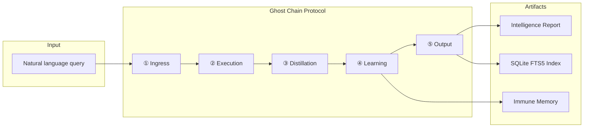
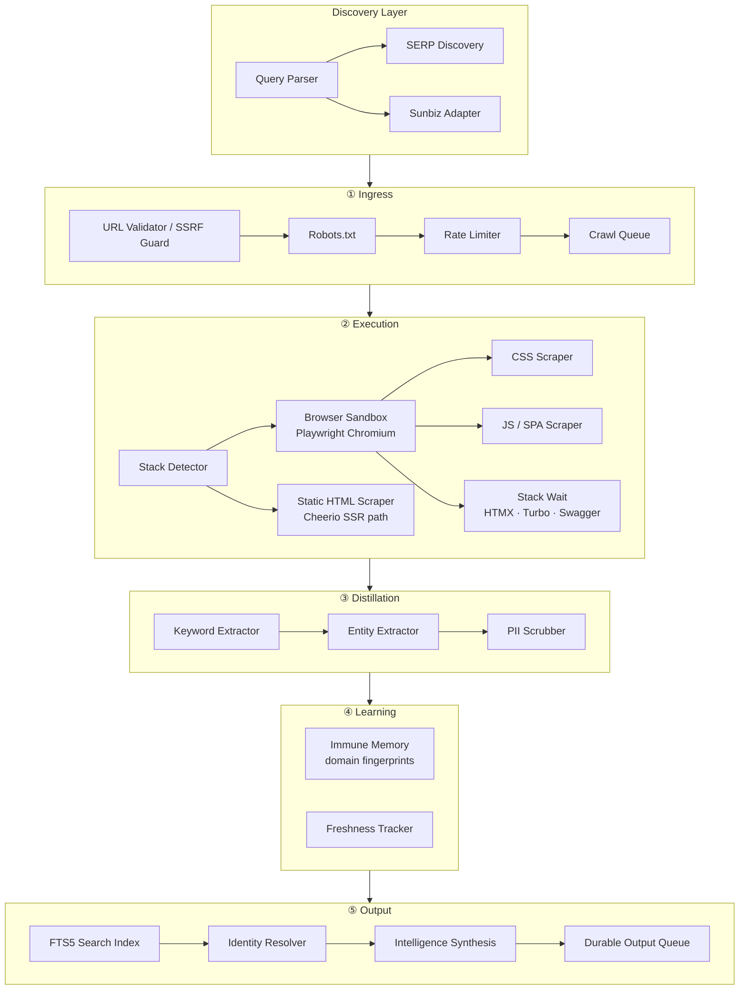
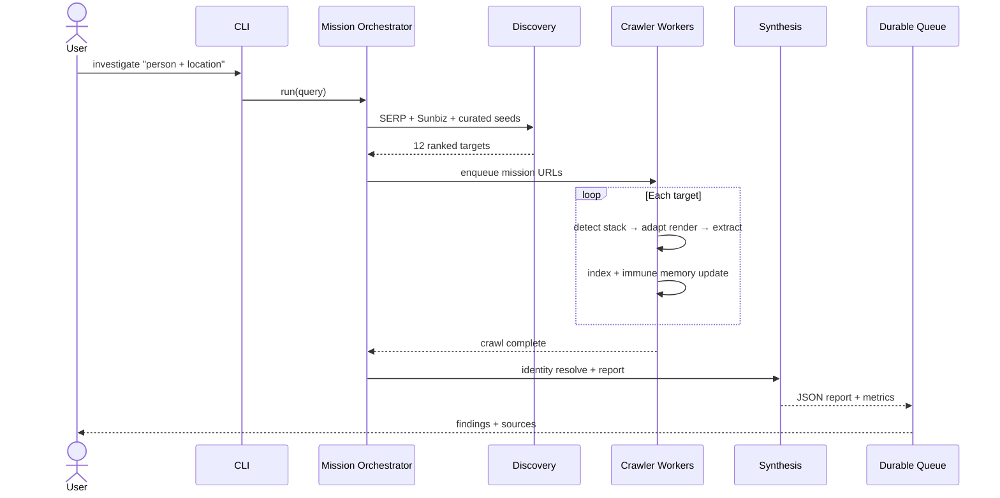
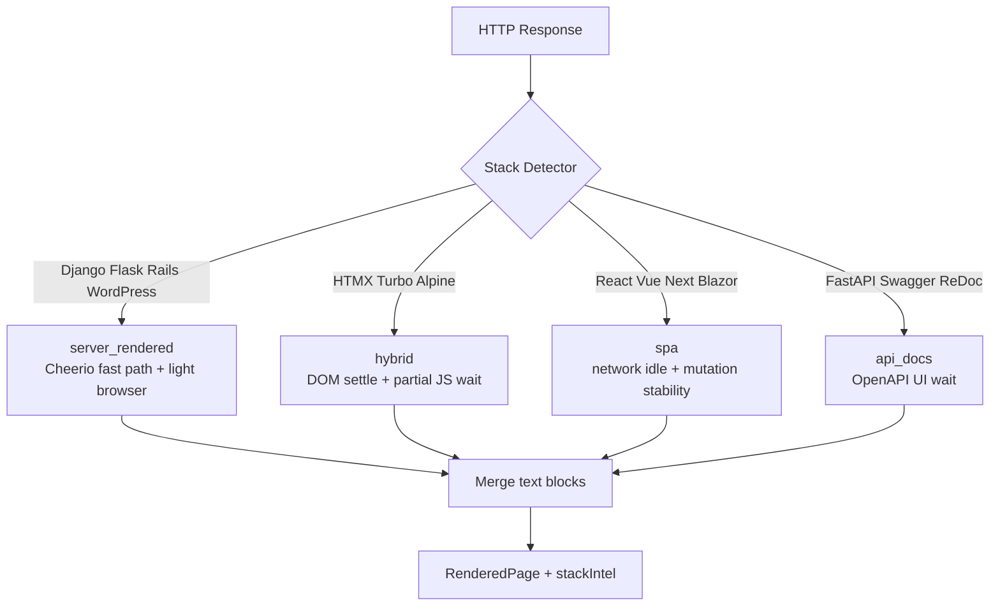
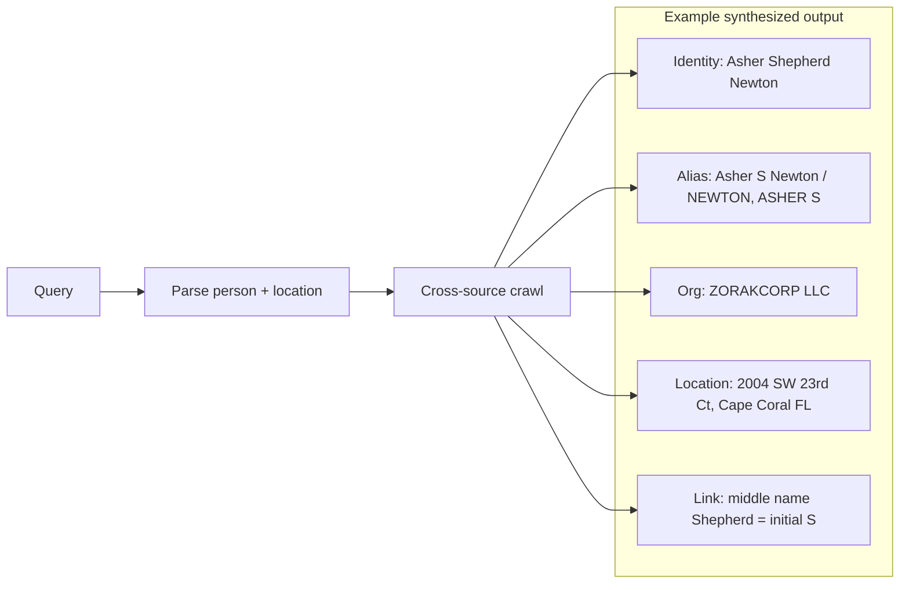
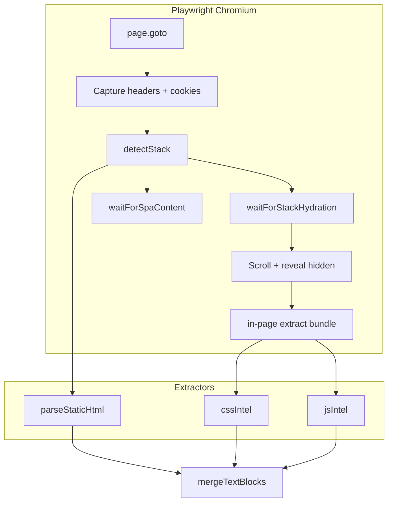
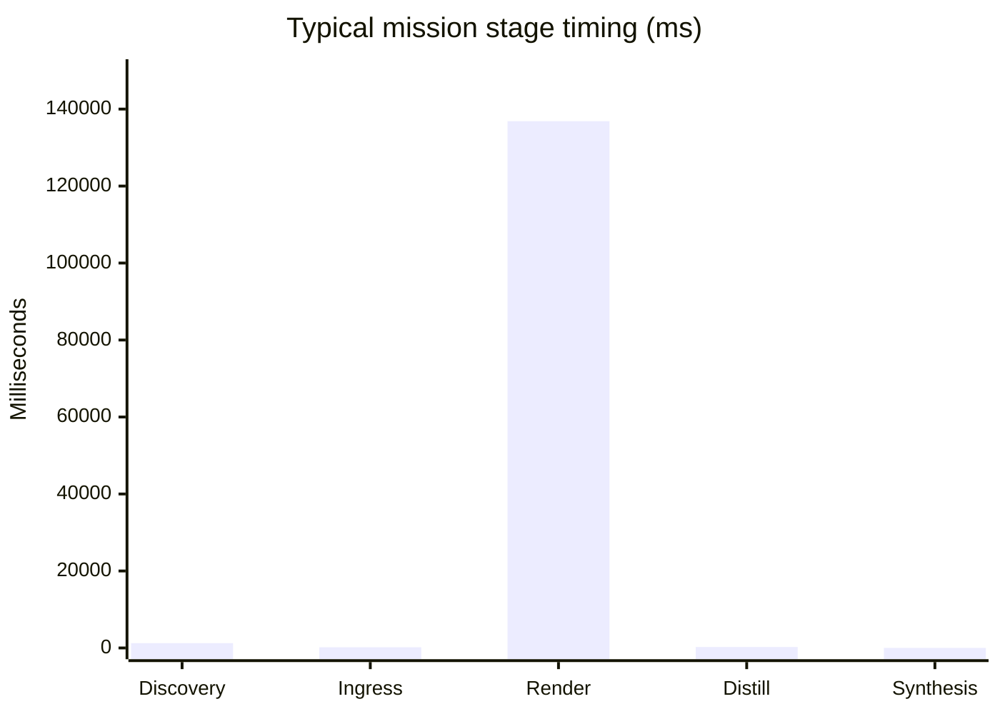

<div align="center">

# Zophiel Search Engine v2

### Ghost Chain Protocol — Universal Intelligence Crawler & Custom Search

[](https://nodejs.org/)
[](https://www.typescriptlang.org/)
[](https://playwright.dev/)
[](https://www.sqlite.org/fts5.html)
[](LICENSE)

**Stack-aware rendering · Multi-language site support · Identity synthesis · Production-grade crawl pipeline**

[Quick Start](#-quick-start) · [Architecture](#-architecture) · [Investigate Mode](#-investigate-mode) · [Stack Detection](#-universal-stack-detection) · [API](#-api)

</div>

---

## Overview

**Zophiel v2** is a TypeScript search engine and intelligence crawler that goes beyond link ranking. It discovers targets from natural-language queries, renders pages across **any web stack** (Python/Django, Ruby/Rails, PHP/WordPress, ASP.NET, React SPAs, HTMX hybrids), distills structured findings, and synthesizes identity-linked reports.

Where traditional search engines return ten blue links, Zophiel returns **resolved identity, corporate filings, addresses, and cross-source evidence** — assembled from public records the index never connects for you.



---

## Architecture

Five-phase pipeline inspired by the Ghost Chain Protocol — each phase is independently observable, retryable, and mission-scoped.



### Mission orchestrator flow



---

## Universal stack detection

Zophiel does not execute Python, Ruby, or PHP — it **detects the stack** and adapts rendering strategy automatically.



| Language | Frameworks detected | Render mode |
|----------|---------------------|-------------|
| **Python** | Django, Flask, FastAPI, Streamlit, Wagtail, Gunicorn, Uvicorn | SSR / hybrid / API docs |
| **JavaScript/TS** | React, Vue, Angular, Next.js, Express, NestJS | SPA / SSR |
| **Ruby** | Rails, Sinatra | Hybrid / SSR |
| **PHP** | WordPress, Laravel, Drupal | SSR |
| **C#** | ASP.NET, Blazor | SSR / SPA |
| **Java** | Spring, JSP | SSR |
| **Go · Rust · Elixir · Perl** | Gin, Rocket, Phoenix, CGI | SSR / hybrid |
| **Hybrid libs** | HTMX, Turbo, Alpine.js, jQuery | Hybrid |

---

## Investigate mode

One command runs the full intelligence pipeline:

```bash
npm run investigate -- "asher shepherd newton who lives in cape coral florida"
```



**What Zophiel finds that generic search often misses:**

- Corporate registered-agent address linked to a person query (via [bisprofiles](https://bisprofiles.com) + Sunbiz cross-reference)
- Middle-name ↔ public-record initial resolution (`Shepherd` → `S`)
- Florida LLC entity graph (ZORAKCORP, BOSLEY.SOCIAL)
- Sunbiz name-search traps (full name matches wrong entities — surfaced as negative intelligence)

Reports are saved to `data/reports/<mission-id>.json` with stage timings and at-least-once delivery guarantees.

---

## Quick start

### Prerequisites

- **Node.js ≥ 20**
- **Chromium** (via Playwright)

### Install

```bash
git clone https://github.com/shep95/zophiel_search_engine.v2.git
cd zophiel_search_engine.v2
npm install
npm run playwright:install
npm run build
```

### Commands

| Command | Description |
|---------|-------------|
| `npm run investigate -- "<query>"` | Full discovery → crawl → intelligence report |
| `npm run crawl` | Start persistent crawler workers |
| `npm run seed -- <url> [url...]` | Enqueue seed URLs |
| `npm run search -- "<query>"` | Search the local FTS5 index |
| `npm run api` | Start REST API on `:3847` |
| `npm run dev` | Watch mode for CLI development |

### Example session

```bash
# Run an intelligence mission
npm run investigate -- "company name officer florida"

# Search indexed corpus
npm run search -- "registered agent cape coral"

# Crawl specific targets
npm run seed -- https://example.com
npm run crawl
```

---

## Project structure

```
zophiel_search_engine.v2/
├── src/
│   ├── ingress/          # URL validation, robots, rate limits, queue
│   ├── execution/        # Browser sandbox, stack detection, CSS/JS scrapers
│   ├── discovery/        # Query parser, SERP discovery
│   ├── adapters/         # Sunbiz and domain-specific adapters
│   ├── distillation/     # Keywords, entities, PII scrubbing
│   ├── learning/         # Immune memory (per-domain fingerprints)
│   ├── search/           # SQLite FTS5 index
│   ├── synthesis/        # Identity resolver + intelligence reports
│   ├── mission/          # Mission orchestrator
│   ├── observability/    # Stage metrics
│   ├── output/           # Durable JSONL queue
│   └── cli.ts            # CLI entry point
├── scripts/              # Test and utility scripts
└── data/                 # Runtime DB, reports (gitignored)
```

---

## Execution layer detail



**CSS scraping:** stylesheet URLs, fetched `.css` content, hidden rules, computed visibility, `::before`/`::after` pseudo text.

**JS / SPA scraping:** framework detection, JSON-LD, `__NEXT_DATA__`, API JSON capture, shadow DOM traversal, DOM mutation quiet period.

---

## Configuration

Key options in `src/config/index.ts`:

| Option | Default | Purpose |
|--------|---------|---------|
| `spaWaitEnabled` | `true` | Wait for SPA hydration |
| `fetchExternalStylesheets` | `true` | Pull linked CSS for hidden-content analysis |
| `domMutationQuietMs` | `2000` | DOM stability window |
| `piiScrubMode` | `sensitive_only` | Scrub SSN/email/phone; keep names/addresses |
| `respectRobotsTxt` | `true` | Honor robots.txt |
| `concurrency` | `3` | Parallel crawl workers |

---

## API

```bash
npm run api
# → http://127.0.0.1:3847
```

Fastify server with CORS — exposes search and crawl endpoints for integration into larger pipelines.

---

## Observability

Every mission emits structured stage metrics:



| Metric | Description |
|--------|-------------|
| `pagesCrawled` | Successfully indexed pages |
| `pagesFailed` | HTTP / render failures |
| `pagesBlocked` | robots.txt / policy blocks |
| `antiBotDetections` | Captcha / bot-wall hits |
| `findingsCount` | Structured intelligence findings |

---

## Tech stack

| Layer | Technology |
|-------|------------|
| Runtime | Node.js 20+, ESM |
| Language | TypeScript 5.7 |
| Browser automation | Playwright (Chromium) |
| HTML parsing | Cheerio |
| Search index | better-sqlite3 + FTS5 |
| API | Fastify 5 |
| Validation | Zod |
| Logging | Pino |

---

## Roadmap

- [ ] Sunbiz ASP.NET entity detail drill-down (session-aware)
- [ ] Force-refresh high-value sources on investigate missions
- [ ] CAPTCHA / proxy lane for gated sites (Bizapedia, LinkedIn)
- [ ] Address extraction in synthesis pipeline from CSS pseudo-text
- [ ] Web UI for investigate results

---

## License

MIT © [shep95](https://github.com/shep95)

---

<div align="center">

**Zophiel Search Engine v2** — *Search that understands how the web is built.*

[github.com/shep95/zophiel_search_engine.v2](https://github.com/shep95/zophiel_search_engine.v2)

</div>
