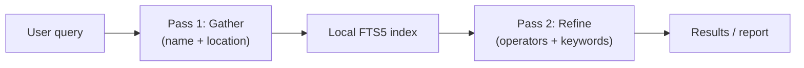
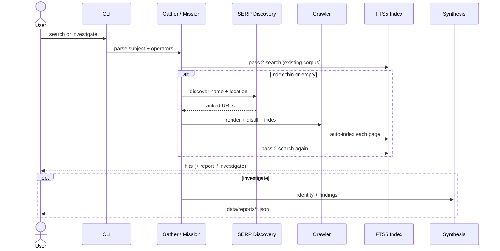
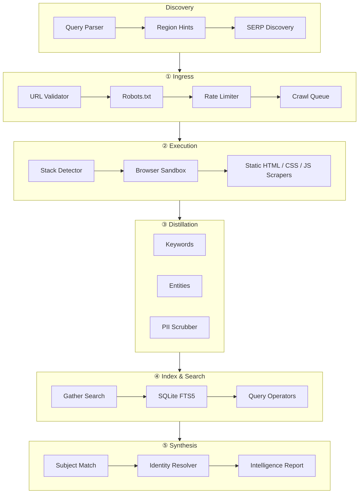

<div align="center">

# Zophiel Search Engine v2

### Ghost Chain Protocol — International Intelligence Crawler & Custom Search

[](https://nodejs.org/)
[](https://www.typescriptlang.org/)
[](https://playwright.dev/)
[](https://www.sqlite.org/fts5.html)
[](LICENSE)

**Two-pass gather & search · Search operators · Stack-aware rendering · Query-driven synthesis**

[Quick Start](#-quick-start) · [Two-Pass Search](#-two-pass-search) · [Search Operators](#-search-operators) · [Architecture](#-architecture) · [API](#-api)

</div>

---

## Overview

**Zophiel v2** is an international search engine and intelligence crawler. It does not rank the whole web — it **gathers pages about a subject**, indexes them locally, and lets you **refine that corpus** with keywords and search operators.

The mental model:

| Role | What it does |
|------|----------------|
| **Crawler** | Field agent — discovers and fetches pages about the query subject |
| **Index** | Case file — everything gathered, stored in SQLite FTS5 |
| **Operators** | Analyst's highlighter — `site:`, `intitle:`, `filetype:`, `inurl:` |
| **Second search** | Analyst reading the case file with filters — not blind re-queries |

There are **no hardcoded people, URLs, or country-specific results** in the core logic. Discovery, indexing, and synthesis are driven entirely by what the user types.



---

## Two-pass search

`search` is the default intelligence command. It runs automatically:

1. **Pass 1 — Gather** — Parses the subject (name, location, topic). If the index is empty or thin, the crawler discovers URLs via region-aware SERP, renders pages, and indexes them.
2. **Pass 2 — Refine** — Searches the local index with the full query, including operators.

```bash
# Pass 1 gathers pages about Wei Zhang in Beijing; pass 2 searches the index
npm run search -- "wei zhang who lives in beijing china"

# After gather, narrow with operators (pass 2 only on existing index)
npm run search -- "site:linkedin.com intitle:engineer wei zhang"

# Skip gathering — index-only search
npm run search -- "wei zhang" --local
```

International location parsing supports countries worldwide (China, Australia, Peru, UK, etc.). SERP discovery uses DuckDuckGo regional hints (`cn-zh`, `au-en`, `pe-es`, …) based on parsed location.

---

## Search operators

Operators apply in **pass 2** — they filter and rank what is already in the case file.

| Operator | Example | Behavior |
|----------|---------|----------|
| `site:` | `site:linkedin.com maria silva` | Restrict to hostname (includes subdomains) |
| `filetype:` | `filetype:pdf annual report` | URL path ends with extension |
| `intitle:` | `intitle:director james o'brien` | Match terms in page title (FTS column) |
| `inurl:` | `inurl:profile sydney` | Match terms in the URL string |

Combined example:

```bash
npm run search -- "site:gov.au filetype:pdf maria chen australia"
```

Quoted phrases and mixed free text are supported: `intitle:"annual report" filetype:pdf site:sec.gov`.

---

## Investigate mode

For a full structured intelligence report (identity resolution, findings, durable JSON output):

```bash
npm run investigate -- "james o'brien who lives in sydney australia"
```



Reports are saved to `data/reports/<mission-id>.json`.

---

## Architecture



### Universal stack detection

Zophiel detects the web stack and adapts rendering (SSR, SPA, HTMX hybrid, API docs) across Python, Ruby, PHP, .NET, React, Vue, and more. See `src/execution/stack-detector.ts`.

---

## Quick start

### Prerequisites

- **Node.js ≥ 20**
- **Chromium** (via Playwright)

### Install

```bash
git clone https://github.com/shep95/zophiel_search_engine.v2.git
cd zophiel_search_engine.v2
npm install
npm run playwright:install
npm run build
```

### Commands

| Command | Description |
|---------|-------------|
| `npm run search -- "<query>"` | **Two-pass search** — gather subject pages, then search with operators (default) |
| `npm run search -- "<query>" --local` | Index-only search; skip pass 1 gather |
| `npm run investigate -- "<query>"` | Full mission → crawl → structured intelligence report |
| `npm run crawl` | Persistent crawler workers |
| `npm run seed -- <url> [url...]` | Enqueue seed URLs |
| `npm run api` | REST API on `:3847` |
| `npm run dev` | Watch mode for CLI development |

### Example session

```bash
# International person lookup (gather + search)
npm run search -- "maria silva from lima peru"

# Refine gathered corpus
npm run search -- "site:linkedin.com intitle:engineer maria silva"

# Deep intelligence report
npm run investigate -- "james o'brien sydney australia"

# General topic
npm run search -- "renewable energy policy chile"
```

---

## Project structure

```
zophiel_search_engine.v2/
├── src/
│   ├── intelligence/     # Two-pass gather-search orchestrator
│   ├── discovery/        # Query parser, region hints, SERP discovery
│   ├── search/           # FTS5 index + query operators
│   ├── ingress/          # URL validation, robots, rate limits, queue
│   ├── execution/        # Browser sandbox, stack detection, scrapers
│   ├── distillation/     # Keywords, entities, PII scrubbing
│   ├── learning/         # Immune memory (per-domain fingerprints)
│   ├── synthesis/        # Subject match, identity resolver, reports
│   ├── mission/          # Full investigate orchestrator
│   ├── adapters/         # Optional domain adapters (e.g. registry sites)
│   ├── api/              # Fastify REST server
│   └── cli.ts
├── scripts/
└── data/                 # Runtime DB, reports (gitignored)
```

---

## API

```bash
npm run api
# → http://127.0.0.1:3847
```

| Endpoint | Description |
|----------|-------------|
| `GET /search?q=...&gather=true` | Two-pass search (gather on by default) |
| `GET /search?q=...&gather=false` | Index-only search |
| `GET /health` | Health check |
| `GET /stats` | Crawl queue stats |
| `POST /seed` | Enqueue URLs |

Example:

```bash
curl "http://127.0.0.1:3847/search?q=wei+zhang+beijing+china&limit=10"
curl "http://127.0.0.1:3847/search?q=site%3Alinkedin.com+wei+zhang&gather=false"
```

---

## Configuration

Key options in `src/config/index.ts`:

| Option | Default | Purpose |
|--------|---------|---------|
| `spaWaitEnabled` | `true` | Wait for SPA hydration |
| `fetchExternalStylesheets` | `true` | Pull linked CSS for hidden-content analysis |
| `domMutationQuietMs` | `2000` | DOM stability window |
| `piiScrubMode` | `sensitive_only` | Scrub SSN/email/phone; keep names/addresses |
| `respectRobotsTxt` | `true` | Honor robots.txt |
| `concurrency` | `3` | Parallel crawl workers |

---

## Tech stack

| Layer | Technology |
|-------|------------|
| Runtime | Node.js 20+, ESM |
| Language | TypeScript 5.7 |
| Browser automation | Playwright (Chromium) |
| HTML parsing | Cheerio |
| Search index | better-sqlite3 + FTS5 |
| API | Fastify 5 |
| Validation | Zod |
| Logging | Pino |

---

## Roadmap

- [ ] Country-specific registry adapters (plugin architecture)
- [ ] Web UI for search and investigate results
- [ ] CAPTCHA / proxy lane for gated sites
- [ ] Persistent index sharing across missions
- [ ] Additional operators (`-exclude`, exact phrase combos)

---

## License

MIT © [shep95](https://github.com/shep95)

---

<div align="center">

**Zophiel Search Engine v2** — *Gather first. Search with intent.*

[github.com/shep95/zophiel_search_engine.v2](https://github.com/shep95/zophiel_search_engine.v2)

</div>
